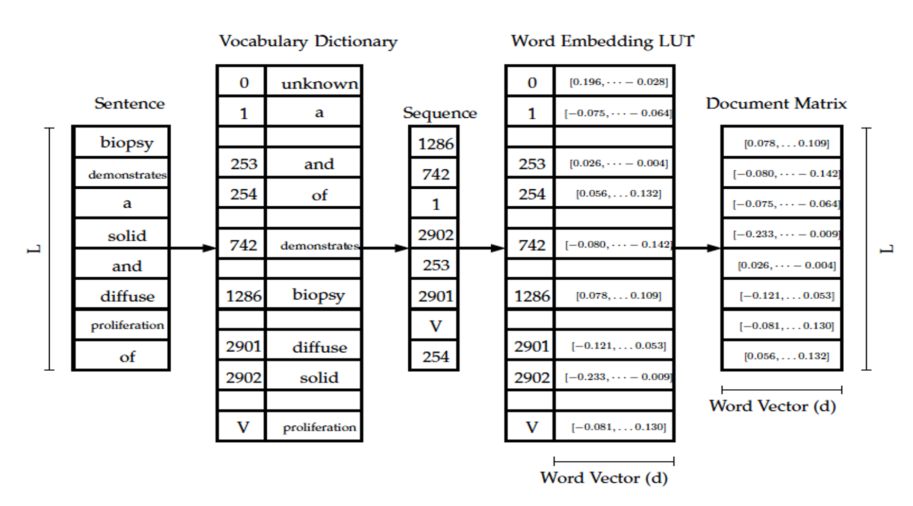

# NCI-DOE-Collab-Pilot3-Privacy_Preserving_DeepLearning_NLP_models
### Description

Population cancer registries can benefit from Deep Learning (DL) to automatically extract cancer characteristics from the high volume of unstructured pathology text reports they process annually. The success of DL to tackle this and other real-world problems is proportional to the availability of large, labeled datasets for model training. Although collaboration among cancer registries is essential to fully exploit the promise of DL, privacy and confidentiality concerns are main obstacles for data sharing across cancer registries. Moreover, DL for natural language processing (NLP) requires sharing a vocabulary dictionary for the embedding layer which may contain patient identifiers. Thus, even distributing the trained models across cancer registries causes a privacy violation issue. We propose approaches of DL NLP model distribution via privacy-preserving transfer learning approaches without sharing sensitive data.

These approaches are used to distribute a multitask convolutional neural network (MT-CNN) NLP model among cancer registries. The model is trained to extract six key cancer characteristics – tumor site, subsite, laterality, behavior, histology, and grade – from cancer pathology reports. Using 410,064 pathology documents from two cancer registries, we compare our proposed approach to conventional transfer learning without privacy-preserving, single-registry models, and a model trained on centrally hosted data. The results show that transfer learning approaches including data sharing and model distribution outperform significantly the single-registry model. In addition, the best performing privacy-preserving model distribution approach achieves statistically indistinguishable average micro- and macro-F1 scores across all extraction tasks (0.823,0.580) as compared to the centralized model (0.827,0.585).

### User Community
Experienced data scientists, computational scientists, artificial intelligence researchers, clinical researchers, and all researchers dealing with sensitive data assets.

### Uniqueness
Word embeddings have been recognized as one of the key breakthroughs for various NLP applications such as document classification, and machine translation. Word embeddings provide a way of converting words into numerical vectors which are used as inputs to DL models. These vectors have relatively lower dimensional features than the one-hot representation. Word embeddings have been shown to capture semantic information via observed similarities in word contexts, where the vector representations of semantically similar words are close to each other. Thus, they insert contextual knowledge into models helping DL algorithms to automatically understand word analogies and capture their semantic properties. Figure 1 below illustrates the traditional word embeddings process. It starts by collecting all unique words in a corpus as a vocabulary list of size V . Then each word in the vocabulary list is assigned to an integer index i, where i 2 {1, 2, . . . V }.

##### Figure1 : Word embedding example diagram, where vocabulary dictionary converts words in the input sentence to the corresponding indices and V is the vocabulary dictionary size.

The vocabulary is saved in a dictionary format, where keys are the word tokens and values are their indices. For each document of size L in the dataset, the words are converted to their corresponding indices using the vocabulary dictionary.

These indices are used to access the corresponding word vector representations in the embedding LUT. The number of embedding LUT parameters is proportional to the vocabulary size and word vector representation length, i.e. if a text corpus has V unique words and the feature representation of each word is a d sized vector, then the embedding LUT is going to be d Å~ V dimensional, and each word has a notation that corresponds to d by a one dimensional embedding vector. This process results in a document matrix of size L Å~ d which is used as input to the convolution layer. Since the dictionary is associated to the NLP DL model trained on the data corpus, it is required when the trained model is used for inference. Since this dictionary is comprised of word tokens that appear in the data corpus of the cancer registry that provides the training data, it is expected to include word tokens associated with patient last names and other protected identifier information. Thus, the trained model and its related dictionary does not preserve data privacy if it is shared with another cancer registry.

The word vector representations can be learned from a large text corpus through Word2Vec or GloVe techniques separately from the other model parameters. They can also be learned from a task specific dataset with the other model parameters through back propagation. In this paper, the word embeddings parameters are randomly initialized and learned through back propagation since previous studies have shown to work well for this application.

### Components
N/A

### Technical Details
Refer to the publication for more details:
Alawad, Mohammed, Hong-Jun Yoon, Shang Gao, Brent Mumphrey, Xiao-Cheng Wu, Eric B. Durbin, Jong Cheol Jeong et al. "Privacy-Preserving Deep Learning NLP Models for Cancer Registries." IEEE Transactions on Emerging Topics in Computing 01 (2020): 1-1.
